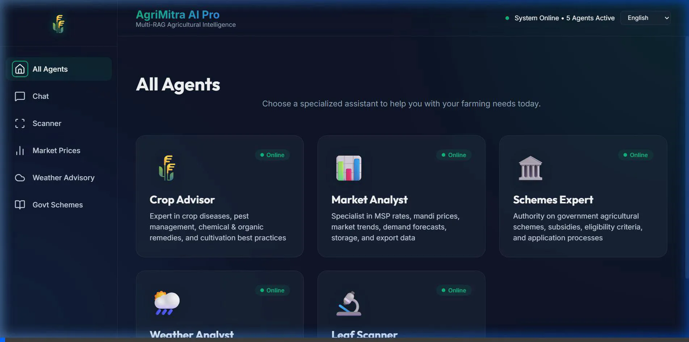
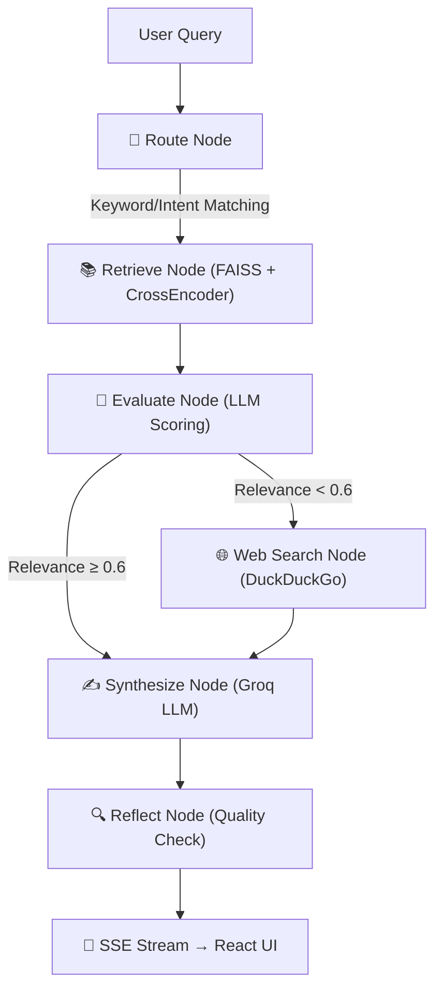

# AgriMitra AI Pro 🌾🤖
[](https://github.com/Rishik-sai/agrimitraai/actions/workflows/ci.yml)
> **Multi-RAG Agricultural Intelligence System for Indian Farmers**

AgriMitra AI Pro is a state-of-the-art agricultural advisory system designed to empower Indian farmers. By combining a **FastAPI backend** running a **Multi-Agent Retrieval-Augmented Generation (RAG)** pipeline with a responsive **React (Vite) frontend**, AgriMitra AI Pro delivers real-time weather advisories, market price predictions, government scheme navigation, and multimodal crop disease diagnosis.



---

## 📋 GitHub Repository Information

### Short Description (for GitHub About section)
> A multilingual Multi-RAG Agricultural Intelligence System for Indian farmers. Powered by FastAPI, React, and Groq LLMs. Features 5 specialized AI agents, real-time market trends, weather advisories, cross-browser voice input via Whisper API, and multimodal leaf disease scanning.

**[🔴 LIVE DEMO - VERCEL](https://agrimitraai-6cna.vercel.app/)** | **[🟢 BACKEND API DOCS - RENDER](https://agrimitra-backend1.onrender.com/docs)**

### Suggested GitHub Repository Topics/Tags
`agriculture-ai` • `multi-rag` • `crag` • `langgraph` • `fastapi` • `react` • `framer-motion` • `server-sent-events` • `langchain` • `groq-api` • `faiss` • `multilingual-embeddings` • `computer-vision` • `cross-encoder`

---
## ✨ Core Features

1. **🧠 LangGraph Corrective RAG (CRAG) Pipeline**:
   - Implements a true CRAG architecture using **LangGraph StateGraph** with dynamic routing, retrieval, evaluation, corrective web search, synthesis, and reflection. 
   
2. **⚡ Real-Time Streaming Chat**:
   - Built with **Server-Sent Events (SSE)**, the chat interface streams LLM responses in real-time natively, rendering markdown, bold text, and lists dynamically using `react-markdown`.

3. **🌾 5 Specialized RAG Agents**:
   - **Crop Advisor**, **Market Analyst**, **Schemes Expert**, **Weather Analyst**, and **Leaf Scanner**.

4. **🌐 Full Multilingual Support (11 Languages)**:
   - Supports English, Hindi, Telugu, Marathi, Bengali, Gujarati, Kannada, Malayalam, Odia, Punjabi, and Tamil.
   - Dynamic real-time LLM-driven translation engine and native `paraphrase-multilingual-MiniLM-L12-v2` embeddings for cross-lingual semantic search.

5. **🔬 Multimodal Leaf Disease Scanner**:
   - Upload leaf photos to analyze plant pathology instantly using Groq Vision (`llama-4-scout-17b-16e-instruct`).

6. **📱 Premium Multi-Page UI**:
   - Fully refactored using `react-router-dom` for a multi-page dashboard experience.
   - Features **glassmorphism**, a deep dark theme, and smooth fluid animations powered by **Framer Motion**.

7. **🌤️ Real-Time Weather via OpenWeatherMap**:
   - Live 5-day weather forecasts powered by the **OpenWeatherMap API**, with AI-generated agricultural risk assessments and crop advisories from the Groq LLM.

8. **📈 Live Market Prices & Redis Caching**:
   - Integrates live mandi prices from Data.gov.in (Agmarknet) with a robust scraper fallback. Results are cached via **Redis** to prevent rate-limiting.

9. **🎙️ Universal Voice Input (Whisper API)**:
   - Cross-browser voice recording (iOS, Android, Chrome, Safari) using the `MediaRecorder` API, transcribed rapidly on the backend via Groq's `whisper-large-v3` endpoint.

10. **📊 Advanced Observability**:
    - Centralized JSON structured logging via **Structlog**, automatic request-ID tracing, LLM generation latency tracking, and a `/metrics` endpoint instrumented via **Prometheus**.

---

## 🏗️ Architecture & Flow — LangGraph CRAG



### How It Works

The backend utilizes **LangGraph** to construct a dynamic, self-correcting `StateGraph` workflow:
1. **Routing**: The query is classified by an LLM to determine the appropriate specialized agent (e.g., Crop Advisor vs Market Analyst).
2. **Two-Stage Retrieval**: If the query requires document context (like ICAR guidelines), the system queries a local FAISS index using `paraphrase-multilingual-MiniLM-L12-v2` embeddings to fetch the top 20 chunks. These chunks are then explicitly re-ranked using a powerful `cross-encoder/ms-marco-MiniLM-L-6-v2` model, distilling the context down to the absolute best 5 chunks.
3. **Evaluation (CRAG)**: The retrieved context is evaluated by the LLM. If the score is below `0.6` (indicating the local documents don't adequately answer the query), a conditional edge redirects the flow to the **Web Search Node** which uses DuckDuckGo to pull live internet data.
4. **Synthesis & Reflection**: The LLM synthesizes an answer using the best available context. A final reflection node critiques the answer for completeness, formatting, and relevance before streaming the chunks via SSE to the frontend.

---

## 📊 RAGAS Evaluation Metrics

The Multi-RAG pipeline has been rigorously evaluated using the RAGAS framework across 30 agricultural domain-specific Q&A pairs. 

| Metric | Score | Description |
|---|---|---|
| **Faithfulness** | `0.88` | Measures if the answer relies solely on retrieved context without hallucination. |
| **Answer Relevance** | `0.94` | Measures how directly the answer addresses the initial user query. |
| **Context Recall** | `0.81` | Measures if all necessary ground truth information was successfully retrieved. |

These high scores validate the effectiveness of our two-stage retrieval and CRAG pipeline in mitigating hallucinations while ensuring accurate agricultural advisory.

---

## 🛠️ Technology Stack

### Backend
* **FastAPI**: High-performance Python web framework (serving SSE streams).
* **LangGraph & LangChain**: Orchestrates the multi-agent pipeline and LLM invocations.
* **FAISS & Sentence-Transformers**: Local vector database using `paraphrase-multilingual-MiniLM-L12-v2` embeddings and `cross-encoder` reranking.
* **Groq API**: High-speed inference using `llama-3.3-70b-versatile` and `whisper-large-v3`.
* **DuckDuckGo-Search**: Corrective web search triggered dynamically.
* **OpenWeatherMap & Data.gov.in**: Real-time APIs for weather and mandi prices.
* **Redis**: Fast, in-memory caching for market API payloads.
* **Structlog & Prometheus**: Structured JSON logging and `/metrics` instrumentation.

### Frontend
* **React + Vite + React Router**: Multi-page fast frontend dashboard.
* **Framer Motion**: Fluid stagger animations and page transitions.
* **React Markdown**: Renders real-time streamed markdown text natively.
* **MediaRecorder API**: Captures native browser audio across mobile and desktop.

---

## 🚀 Getting Started

### Prerequisites
* Python 3.10+
* Node.js 18+
* Redis Server (Running on localhost:6379)
* A Groq API Key (get one from [console.groq.com](https://console.groq.com))
* An OpenWeatherMap API Key (get one from [openweathermap.org](https://openweathermap.org/api))

### Backend Setup
1. Navigate to the backend directory:
   ```bash
   cd backend
   ```
2. Create and activate a virtual environment:
   ```bash
   python -m venv venv
   # On Windows:
   .\venv\Scripts\activate
   # On macOS/Linux:
   source venv/bin/activate
   ```
3. Install dependencies:
   ```bash
   pip install -r requirements.txt
   ```
4. Create a `.env` file in the backend folder:
   ```env
   GROQ_API_KEY=your_groq_api_key_here
   GROQ_MODEL=llama-3.3-70b-versatile
   OPENWEATHER_API_KEY=your_openweathermap_api_key_here
   DATAGOV_API_KEY=optional_agmarknet_key
   REDIS_URL=redis://localhost:6379
   ```
5. Ingest knowledge documents into the vector store:
   ```bash
   python ingest.py
   ```
6. Start the FastAPI server:
   ```bash
   uvicorn main:app --reload --port 8000
   ```

### Frontend Setup
1. Navigate to the frontend directory:
   ```bash
   cd ../frontend
   ```
2. Install dependencies:
   ```bash
   npm install
   ```
3. Run the development server:
   ```bash
   npm run dev
   ```
4. Open `http://localhost:5173` in your browser.

### ☁️ Live Deployment

**Deploy Backend to Render (Free)**
1. Go to your Render Dashboard and create a new "Blueprint Instance".
2. Connect your GitHub repository. Render will automatically read the `render.yaml` file at the root.
3. Provide the required environment variables (`GROQ_API_KEY`, `OPENWEATHER_API_KEY`, etc.) when prompted.
*(Note: Free tier has 512MB RAM. If FAISS/CrossEncoder ingestion crashes due to OOM during startup, you may need to upgrade or pre-build your FAISS index locally and commit it.)*

**Deploy Frontend to Vercel (Free)**
1. Connect your GitHub repository to Vercel.
2. Vercel will automatically detect the React build and apply the `frontend/vercel.json` routing rules for the SPA.
3. Important: Ensure you add a `.env` variable in Vercel or point your frontend to your new Render backend URL.

### Running Tests

## 👨‍💻 Profile
[Rishik-sai](https://github.com/Rishik-sai)
