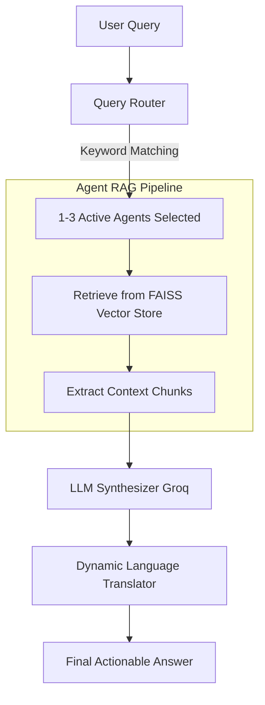

# AgriMitra AI Pro 🌾🤖
> **Multi-RAG Agricultural Intelligence System for Indian Farmers**

AgriMitra AI Pro is a state-of-the-art agricultural advisory system designed to empower Indian farmers. By combining a **FastAPI backend** running a **Multi-Agent Retrieval-Augmented Generation (RAG)** pipeline with a responsive **React (Vite) frontend**, AgriMitra AI Pro delivers real-time weather advisories, market price predictions, government scheme navigation, and multimodal crop disease diagnosis.

---

## 📋 GitHub Repository Information

### Short Description (for GitHub About section)
> A multilingual Multi-RAG Agricultural Intelligence System for Indian farmers. Powered by FastAPI, React, and Groq LLMs. Features 5 specialized AI agents, real-time market trends, weather advisories, voice search, and multimodal leaf disease scanning.

### Suggested GitHub Repository Topics/Tags
`agriculture-ai` • `multi-rag` • `fastapi` • `react` • `langchain` • `groq-api` • `faiss` • `multilingual-ai` • `computer-vision` • `farmers-app` • `disease-detection` • `rag-agents`

---

## ✨ Core Features

1. **🌾 5 Specialized RAG Agents**:
   - **Crop Advisor**: Expert advice on crop diseases, pest control, chemical/organic remedies, and cultivation practices.
   - **Market Analyst**: Real-time MSP (Minimum Support Price) rates, mandi price ranges, demand forecasting, and storage advice.
   - **Schemes Expert**: Detailed guidance on central and state government schemes (e.g., PM-KISAN, PMFBY, Rythu Bharosa) and eligibility criteria.
   - **Weather Analyst**: Localized seasonal advisories, climate risk warnings, and crop suggestions.
   - **Leaf Scanner**: Analyzes visual symptoms of crop leaves and suggests specific cures.

2. **🌐 Full Multilingual Support (11 Languages)**:
   - Supports English, Hindi (हिंदी), Telugu (తెలుగు), Marathi (मराठी), Bengali (বাংলা), Gujarati (ગુજરાતી), Kannada (ಕನ್ನಡ), Malayalam (മലയാളം), Odia (ଓଡ଼ିଆ), Punjabi (ਪੰਜਾਬੀ), and Tamil (தமிழ்).
   - Dynamic real-time LLM-driven translation engine translates server-side agricultural data on the fly.

3. **🎙️ Voice-Activated Search**:
   - Includes a voice input option ("Speak" button) allowing farmers to speak their queries in their preferred language.

4. **🔬 Multimodal Leaf Disease Scanner**:
   - Upload leaf photos to analyze plant pathology instantly. Powered by Groq Vision models (e.g., `meta-llama/llama-4-scout-17b-16e-instruct`) to diagnose leaf diseases, calculate infection severity, and suggest chemical or organic remedies.

5. **🌦️ Weather & Market Price Dashboards**:
   - Real-time district-level weather insights.
   - Mandi pricing ranges, trends (up/down/stable), and market demands per quintal.

---

## 🏗️ Architecture & Flow



- **FAISS Vector Store**: Uses a lightweight sentence-transformer embedding model (`all-MiniLM-L6-v2`) to encode ICAR guidelines, scheme datasets, and market details.
- **Query Routing**: Automatically classifies queries to trigger only the most relevant agents (e.g., querying about paddy prices calls the `Market Analyst` and `Crop Advisor`).

---

## 🛠️ Technology Stack

### Backend
* **FastAPI**: High-performance Python web framework for APIs.
* **LangChain**: Orchestrates the multi-agent vector search and synthesis prompts.
* **FAISS (CPU)**: Efficient local vector database for document storage and retrieval.
* **Groq API**: High-speed inference using `llama-3.3-70b-versatile` and `meta-llama/llama-4-scout-17b-16e-instruct` (Vision).
* **Sentence-Transformers**: Embeds agricultural knowledge documents.

### Frontend
* **React + Vite**: Fast, hot-reloading user interface.
* **Axios**: Communicates with the FastAPI server.
* **Lucide React / Custom Icons**: Modern, responsive dashboard design.
* **Vanilla CSS**: Premium dark-mode layout with glassmorphic cards and interactive grids.

---

## 🚀 Getting Started

### Prerequisites
* Python 3.10+
* Node.js 18+
* A Groq API Key (get one from [console.groq.com](https://console.groq.com))

### Backend Setup
1. Navigate to the backend directory:
   ```bash
   cd backend
   ```
2. Create and activate a virtual environment:
   ```bash
   python -m venv venv
   # On Windows:
   .\venv\Scripts\activate
   # On macOS/Linux:
   source venv/bin/activate
   ```
3. Install dependencies:
   ```bash
   pip install -r requirements.txt
   ```
4. Create a `.env` file in the backend folder:
   ```env
   GROQ_API_KEY=your_groq_api_key_here
   GROQ_MODEL=llama-3.3-70b-versatile
   ```
5. Ingest knowledge documents into the vector store:
   ```bash
   python ingest.py
   ```
6. Start the FastAPI server:
   ```bash
   uvicorn main:app --reload --port 8000
   ```

### Frontend Setup
1. Navigate to the frontend directory:
   ```bash
   cd ../frontend
   ```
2. Install dependencies:
   ```bash
   npm install
   ```
3. Run the development server:
   ```bash
   npm run dev
   ```
4. Open `http://localhost:5173` in your browser.

---

## 📂 Project Structure

```
agrimitraai/
├── backend/
│   ├── data/
│   │   └── docs/          # Ingestible TXT files (schemes, ICAR guidelines, etc.)
│   ├── faiss_index/       # Local vector store index files (generated)
│   ├── main.py            # FastAPI entrypoint, routes, and translations
│   ├── multi_rag.py       # Routing, retrieval, and synthesis engines
│   ├── ingest.py          # Data parsing and FAISS loading script
│   └── requirements.txt
└── frontend/
    ├── src/
    │   ├── components/    # AgentGrid, Chat, Market, Scanner, Schemes, Weather
    │   ├── translations.js# 11-language dictionary mapping
    │   ├── App.jsx
    │   └── main.jsx
    └── package.json
```
