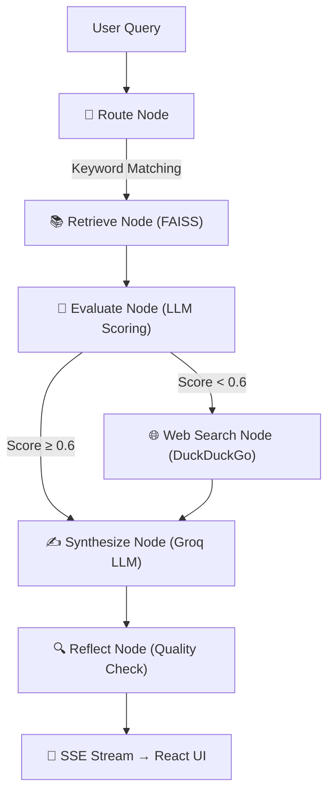

# AgriMitra AI Pro 🌾🤖
[](https://github.com/Rishik-sai/agrimitraai/actions/workflows/ci.yml)
> **Multi-RAG Agricultural Intelligence System for Indian Farmers**

AgriMitra AI Pro is a state-of-the-art agricultural advisory system designed to empower Indian farmers. By combining a **FastAPI backend** running a **Multi-Agent Retrieval-Augmented Generation (RAG)** pipeline with a responsive **React (Vite) frontend**, AgriMitra AI Pro delivers real-time weather advisories, market price predictions, government scheme navigation, and multimodal crop disease diagnosis.

---

## 📋 GitHub Repository Information

### Short Description (for GitHub About section)
> A multilingual Multi-RAG Agricultural Intelligence System for Indian farmers. Powered by FastAPI, React, and Groq LLMs. Features 5 specialized AI agents, real-time market trends, weather advisories, voice search, and multimodal leaf disease scanning.

### Suggested GitHub Repository Topics/Tags
`agriculture-ai` • `multi-rag` • `crag` • `langgraph` • `fastapi` • `react` • `framer-motion` • `server-sent-events` • `langchain` • `groq-api` • `faiss` • `multilingual-ai` • `computer-vision` • `rag-agents`

---
## ✨ Core Features

1. **🧠 LangGraph Corrective RAG (CRAG) Pipeline**:
   - Implements a true CRAG architecture using **LangGraph StateGraph** with 6 nodes: Route → Retrieve → **Evaluate** → (Conditional Web Search) → Synthesize → **Reflect**. The LLM scores retrieval relevance (0-1); if the score falls below 0.6, a corrective DuckDuckGo web search is triggered automatically before synthesis. A final reflection node validates answer quality.
   
2. **⚡ Real-Time Streaming Chat**:
   - Built with **Server-Sent Events (SSE)**, the chat interface streams LLM responses in real-time natively, rendering markdown, bold text, and lists dynamically using `react-markdown`.

3. **🌾 5 Specialized RAG Agents**:
   - **Crop Advisor**, **Market Analyst**, **Schemes Expert**, **Weather Analyst**, and **Leaf Scanner**.

4. **🌐 Full Multilingual Support (11 Languages)**:
   - Supports English, Hindi, Telugu, Marathi, Bengali, Gujarati, Kannada, Malayalam, Odia, Punjabi, and Tamil.
   - Dynamic real-time LLM-driven translation engine.

5. **🔬 Multimodal Leaf Disease Scanner**:
   - Upload leaf photos to analyze plant pathology instantly using Groq Vision (`llama-4-scout-17b-16e-instruct`).

6. **📱 Premium Multi-Page UI**:
   - Fully refactored using `react-router-dom` for a multi-page dashboard experience.
   - Features **glassmorphism**, a deep dark theme, and smooth fluid animations powered by **Framer Motion**.

7. **🌤️ Real-Time Weather via OpenWeatherMap**:
   - Live 5-day weather forecasts powered by the **OpenWeatherMap API**, with AI-generated agricultural risk assessments and crop advisories from the Groq LLM.

8. **🛠️ Automated CI & Testing**:
   - Comprehensive `pytest` backend test suite covering query routing, document chunking, and API health.
   - Fully automated CI pipeline via **GitHub Actions** on every push to `main`.

---

## 🏗️ Architecture & Flow — LangGraph CRAG



- **FAISS Vector Store**: Uses `all-MiniLM-L6-v2` sentence-transformer embeddings to encode static ICAR guidelines.
- **LLM Retrieval Evaluation (CRAG)**: The evaluate node uses the LLM to score retrieval relevance (0-1). Scores below 0.6 trigger a corrective web search — this is real Corrective RAG, not a blind "always search" approach.
- **Reflection**: A final reflect node validates the synthesized answer for completeness and accuracy before streaming.
- **Streaming**: The backend uses LangGraph's `astream_events` to capture LLM tokens and yield them as SSE chunks in real time.

---

## 🛠️ Technology Stack

### Backend
* **FastAPI**: High-performance Python web framework (serving SSE streams).
* **LangGraph**: Orchestrates the full CRAG pipeline as a compiled StateGraph with conditional edges.
* **LangChain**: Manages multi-agent vector search, DuckDuckGo search, and LLM invocations.
* **FAISS (CPU)**: Efficient local vector database.
* **Groq API**: High-speed inference using `llama-3.3-70b-versatile`.
* **DuckDuckGo-Search**: Corrective web search triggered when retrieval is insufficient.
* **OpenWeatherMap API**: Fetches real-time 5-day weather data for accurate agricultural advisories.
* **Pytest**: Backend testing framework for endpoint, routing, and chunking validation.

### Frontend
* **React + Vite + React Router**: Multi-page fast frontend dashboard.
* **Framer Motion**: Fluid stagger animations and page transitions.
* **React Markdown**: Renders real-time streamed markdown text natively.
* **Vanilla CSS**: Premium dark-mode layout with glassmorphic cards and interactive grids.

---

## 🚀 Getting Started

### Prerequisites
* Python 3.10+
* Node.js 18+
* A Groq API Key (get one from [console.groq.com](https://console.groq.com))
* An OpenWeatherMap API Key (get one from [openweathermap.org](https://openweathermap.org/api))

### Backend Setup
1. Navigate to the backend directory:
   ```bash
   cd backend
   ```
2. Create and activate a virtual environment:
   ```bash
   python -m venv venv
   # On Windows:
   .\venv\Scripts\activate
   # On macOS/Linux:
   source venv/bin/activate
   ```
3. Install dependencies:
   ```bash
   pip install -r requirements.txt
   ```
4. Create a `.env` file in the backend folder:
   ```env
   GROQ_API_KEY=your_groq_api_key_here
   GROQ_MODEL=llama-3.3-70b-versatile
   OPENWEATHER_API_KEY=your_openweathermap_api_key_here
   ```
5. Ingest knowledge documents into the vector store:
   ```bash
   python ingest.py
   ```
6. Start the FastAPI server:
   ```bash
   uvicorn main:app --reload --port 8000
   ```

### Frontend Setup
1. Navigate to the frontend directory:
   ```bash
   cd ../frontend
   ```
2. Install dependencies:
   ```bash
   npm install
   ```
3. Run the development server:
   ```bash
   npm run dev
   ```
4. Open `http://localhost:5173` in your browser.

### Running Tests
```bash
cd backend
pytest tests/
```

---

## 📂 Project Structure

```
agrimitraai/
├── .github/
│   └── workflows/
│       └── ci.yml             # GitHub Actions CI pipeline
├── backend/
│   ├── data/
│   │   └── docs/              # Ingestible TXT files (schemes, ICAR guidelines, etc.)
│   ├── faiss_index/           # Local vector store index files (generated)
│   ├── tests/
│   │   ├── test_router.py     # Tests for query routing logic
│   │   ├── test_ingest.py     # Tests for document chunking
│   │   └── test_api.py        # Tests for /health endpoint
│   ├── main.py                # FastAPI entrypoint, routes, and translations
│   ├── multi_rag.py           # LangGraph CRAG pipeline (route, retrieve, evaluate, synthesize, reflect)
│   ├── ingest.py              # Data parsing and FAISS loading script
│   └── requirements.txt
├── frontend/
│   ├── src/
│   │   ├── components/        # AgentGrid, Chat, Market, Scanner, Schemes, Weather
│   │   ├── translations.js    # 11-language dictionary mapping
│   │   ├── App.jsx
│   │   └── main.jsx
│   └── package.json
├── docker-compose.yml
├── .env.example
└── README.md
```

---

## 👨‍💻 Profile
[Rishik-sai](https://github.com/Rishik-sai)
